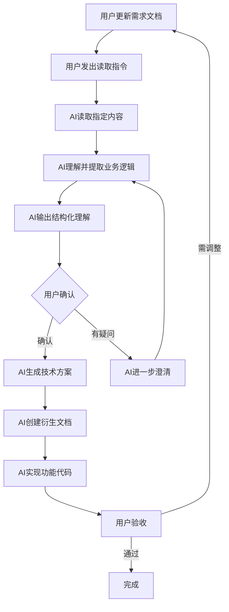

# AI协作规则文档

> **文档版本**: v1.1  
> **创建时间**: 2026-01-15  
> **更新时间**: 2026-01-15  
> **适用项目**: 灵机系统IP权益变现应用  
> **开发模式**: 纯前端演示系统（无后端/数据库）  
> **协作原则**: 人机分工明确，效率与控制并重

---

## 🎯 开发模式说明

### 0. 纯前端演示系统

**本项目采用纯前端开发模式**，目标是创建一个**流畅交互的前端演示系统**。

#### **开发范围**

| 类型 | 状态 | 说明 |
|------|------|------|
| **前端UI** | ✅ 开发 | 完整的界面设计和视觉呈现 |
| **交互逻辑** | ✅ 开发 | 用户操作的响应和状态管理 |
| **Mock数据** | ✅ 提供 | 模拟真实业务数据 |
| **后端API** | ❌ 不开发 | 无需实现真实接口 |
| **数据库** | ❌ 不开发 | 无需数据持久化 |

#### **技术方案**

```yaml
技术栈:
  基础: HTML5 + CSS3 + JavaScript (ES6+)
  样式: 基于已完成的《灵机系统设计规范》
  数据: Mock数据 + LocalStorage（可选）
  交互: 原生JS / 轻量级库

数据模拟策略:
  - 内置JSON格式的Mock数据
  - 使用LocalStorage模拟数据持久化（刷新后数据保留）
  - 所有增删改查操作仅在前端完成

部署方式:
  - 直接用浏览器打开HTML文件
  - 或通过简单HTTP服务器预览（python -m http.server）
```

#### **AI工作内容**

读取需求后，AI将生成：
1. **HTML结构** - 完整的页面布局
2. **CSS样式** - 基于设计规范的组件样式
3. **JavaScript逻辑** - 交互行为和数据操作
4. **Mock数据** - 模拟真实业务数据结构
5. **使用说明** - 如何打开和演示

#### **适用场景**

- ✅ 向客户/领导演示产品原型
- ✅ 验证业务流程和交互逻辑
- ✅ 快速迭代UI设计
- ✅ 作为后端开发的前端规范参考
- ✅ 收集用户反馈，优化体验

---

## 📜 核心协作原则

### 1. 文件权限约定

#### **只读文件（AI不可编辑）**

| 文件名 | 权限 | 说明 | AI职责 |
|--------|------|------|--------|
| **灵机系统IP权益变现应用需求梳理.md** | 🔒 只读 | 业务需求的真实来源 | 仅读取、理解、转化 |

**权限规则**：
```yaml
文件: 灵机系统IP权益变现应用需求梳理.md
AI权限:
  - ✅ 允许: 读取全文
  - ✅ 允许: 读取指定行数
  - ✅ 允许: 搜索关键词
  - ✅ 允许: 提取业务逻辑
  - ❌ 禁止: 写入任何内容
  - ❌ 禁止: 修改现有内容
  - ❌ 禁止: 删除任何内容
  - ❌ 禁止: 重命名文件
  - ❌ 禁止: 格式化或优化
```

**违规处理**：
- 如果AI尝试编辑此文件，必须立即停止并说明原因
- AI应提醒用户自行编辑，而非代为修改

---

#### **AI可编辑的衍生文件**

| 文件类型 | 权限 | 说明 |
|---------|------|------|
| 技术设计文档 | ✅ 读写 | AI根据需求生成的技术方案 |
| 数据库设计 | ✅ 读写 | AI设计的数据模型 |
| 开发任务清单 | ✅ 读写 | AI拆解的开发任务 |
| 代码文件 | ✅ 读写 | AI实现的功能代码 |
| 设计规范文档 | ✅ 读写 | AI创建的设计系统 |

---

## 🗣️ 交互指令规范

### 2. 标准指令集

#### **类型A：内容读取指令**

| 指令格式 | 功能 | 示例 |
|---------|------|------|
| `读取需求文档全文` | 读取完整内容 | "读取需求文档全文并总结核心功能" |
| `读取需求文档第X-Y行` | 读取指定行范围 | "读取需求文档第50-80行" |
| `读取需求文档[模块名]` | 读取指定模块 | "读取需求文档【IP资产管理】模块" |
| `搜索需求文档关键词` | 搜索并提取相关内容 | "在需求文档中搜索'权限管理'" |

**AI响应流程**：
```
1. 执行读取操作
2. 提取业务逻辑
3. 识别关键要素（数据、流程、规则）
4. 输出理解结果（结构化）
5. 询问是否需要生成技术方案
```

---

#### **类型B：技术转化指令**

| 指令格式 | 功能 | 输出物 |
|---------|------|--------|
| `基于第X-Y行生成数据库设计` | 需求→数据模型 | 数据库设计文档.md / .sql |
| `基于[模块]生成技术方案` | 需求→技术架构 | 技术设计文档.md |
| `把第X-Y行转化为开发任务` | 需求→任务清单 | 开发任务清单.md |
| `基于[模块]设计UI界面` | 需求→界面设计 | HTML/CSS原型 |

**AI工作标准**：
- 技术方案必须可追溯到原始需求
- 每个技术决策注明对应需求文档的行数或章节
- 生成的文档需包含"需求来源"章节

---

#### **类型C：增量更新指令**

| 指令格式 | 功能 | 使用场景 |
|---------|------|---------|
| `需求文档新增了第X-Y行` | 识别新增需求 | 您添加了新需求 |
| `第X行的逻辑改了，重新读取` | 识别变更 | 您修改了现有需求 |
| `对比需求文档与上次的变化` | 差异分析 | 大量修改后的同步 |

**AI响应动作**：
1. 读取变更内容
2. 识别影响范围（哪些已实现的功能受影响）
3. 列出需要调整的技术文档和代码
4. 等待用户确认后执行更新

---

#### **类型D：校验对齐指令**

| 指令格式 | 功能 | 输出 |
|---------|------|------|
| `检查代码是否符合需求文档第X行` | 需求-代码一致性检查 | 对比报告 |
| `验证数据库设计是否满足[模块]需求` | 需求-设计一致性检查 | 验证报告 |
| `列出未实现的需求` | 需求完成度检查 | 待办清单 |

---

## 🔄 标准工作流程

### 3. 完整协作流程



---

### 4. 典型协作场景

#### **场景1：新增功能需求**

**用户操作**：
1. 在需求文档中添加内容（例如：第100-150行）
2. 发出指令："读取需求文档第100-150行"

**AI执行**：
1. 读取第100-150行内容
2. 提取关键信息：
   - 功能名称
   - 业务规则
   - 数据要素
   - 交互流程
3. 输出结构化理解：
   ```markdown
   ## 需求理解（第100-150行）
   
   ### 功能名称
   [提取的功能名称]
   
   ### 核心业务规则
   - 规则1
   - 规则2
   
   ### 涉及数据
   - 数据表1：字段列表
   - 数据表2：字段列表
   
   ### 技术要点
   - 要点1
   - 要点2
   ```
4. 询问："是否需要我生成技术设计方案？"

**用户确认**：
- "是" → AI生成技术文档
- "否" → AI等待下次指令

---

#### **场景2：需求变更**

**用户操作**：
1. 修改需求文档某一行（例如：第68行）
2. 发出指令："第68行的逻辑改了，重新读取"

**AI执行**：
1. 读取第68行及上下文（前后各5行）
2. 识别变更内容
3. 搜索已有技术文档和代码中引用此需求的位置
4. 输出影响分析报告：
   ```markdown
   ## 变更影响分析
   
   ### 变更内容
   [旧内容] → [新内容]
   
   ### 影响范围
   - 技术文档：xxx.md 第50行
   - 数据库设计：xxx.sql 第30行
   - 代码文件：xxx.js 第100-120行
   
   ### 建议操作
   1. 更新技术文档
   2. 修改数据库字段
   3. 调整代码逻辑
   ```
5. 询问："是否立即执行这些更新？"

---

#### **场景3：全局理解**

**用户操作**：
发出指令："读取需求文档全文，梳理所有功能模块"

**AI执行**：
1. 读取完整需求文档
2. 识别章节结构
3. 提取所有功能模块
4. 输出全局架构：
   ```markdown
   ## 灵机系统功能架构
   
   ### 模块1：IP资产管理（第10-80行）
   - 功能1.1：IP等级系统
   - 功能1.2：IP权益分类
   
   ### 模块2：商业流程管理（第81-150行）
   - 功能2.1：合同管理
   - 功能2.2：结算流程
   
   ### 模块3：数据权限系统（第151-200行）
   - 功能3.1：角色权限
   - 功能3.2：数据隔离
   ```
5. 询问："需要我为哪个模块优先生成技术方案？"

---

## 📝 需求文档书写建议（可选）

### 5. 推荐的文档结构（供用户参考）

虽然AI不会修改您的需求文档，但如果您的文档采用以下结构，AI会理解得更准确：

```markdown
# 灵机系统IP权益变现应用需求梳理

## 模块1：[模块名称]

### 功能1.1：[功能名称]
**业务场景**：
描述用户在什么场景下使用此功能

**核心需求**：
- 需求点1
- 需求点2

**业务规则**：
- 规则1
- 规则2

**数据要素**：
- 需要存储的数据1
- 需要存储的数据2

**备注**：
其他补充说明

---

### 功能1.2：[功能名称]
...
```

**但这不是强制要求！您可以用任何方式书写，AI会尽力理解。**

---

### 6. 可选的标记系统（增强协作）

如果您想让AI更精确地理解优先级和状态，可以使用以下标记（完全可选）：

```markdown
### 功能：IP等级系统
<!-- STATUS: 已确认 -->
<!-- PRIORITY: P0 -->

核心需求内容...

---

### 功能：权益分类
<!-- STATUS: 草稿 -->
<!-- PRIORITY: P1 -->
<!-- @AI: 这部分还在思考，暂时不要生成技术方案 -->

初步想法...
```

**标记说明**：
- `<!-- STATUS: 已确认/草稿/待讨论 -->` - 需求成熟度
- `<!-- PRIORITY: P0/P1/P2 -->` - 优先级（P0最高）
- `<!-- @AI: 指令 -->` - 给AI的特殊说明

**但重申：这些标记完全可选，不使用也不影响协作。**

---

## 🛡️ AI工作准则

### 7. AI必须遵守的规则

1. **永远不修改需求梳理文档**
   - 即使发现错别字也不修改
   - 即使格式混乱也不调整
   - 即使可以优化也不擅自行动

2. **每次读取需求后必须输出理解结果**
   - 不能只读不说
   - 必须让用户知道AI理解了什么
   - 用结构化格式输出，便于用户确认

3. **技术方案必须可追溯**
   - 每个技术决策注明来源（需求文档行数）
   - 生成的代码包含注释指向需求
   - 衍生文档包含"需求来源"章节

4. **遇到歧义必须询问**
   - 不能擅自猜测用户意图
   - 不能做假设性实现
   - 必须明确确认后再执行

5. **定期同步和校验**
   - 每完成一个功能模块后，主动对照需求检查
   - 发现偏差立即报告
   - 询问用户是否需要重新对齐

---

## 📊 协作效果评估

### 8. 定期检查清单（建议每周执行）

**用户检查**：
- [ ] 需求文档是否被AI误修改？（检查文件修改时间）
- [ ] AI生成的技术方案是否符合需求？
- [ ] 是否有遗漏或理解偏差的需求？

**AI自查**：
- [ ] 是否严格遵守了只读权限？
- [ ] 所有技术文档是否标注了需求来源？
- [ ] 是否有未明确确认就执行的操作？

---

## 🚀 快速上手

### 9. 立即开始协作的三步骤

**第一步：用户添加需求**
```
在「灵机系统IP权益变现应用需求梳理.md」中
随意书写您的业务需求
```

**第二步：通知AI读取**
```
发送指令："读取需求文档第X-Y行"
或："读取需求文档全文"
```

**第三步：确认AI理解**
```
查看AI输出的理解结果
确认无误后，让AI生成技术方案
```

**完成！开始迭代开发。**

---

## 📌 附录

### 10. 指令速查表

| 您想做什么 | 指令示例 |
|-----------|---------|
| 让AI理解新需求 | "读取需求文档第50-80行" |
| 让AI理解整体架构 | "读取需求文档全文并梳理模块" |
| 需求改了，让AI知道 | "第68行逻辑改了，重新读取" |
| 搜索特定功能 | "在需求文档中搜索'权限管理'" |
| 生成技术方案 | "基于第100-150行生成技术设计" |
| 生成开发任务 | "把第100-150行拆解为开发任务" |
| 检查实现是否对齐 | "检查当前代码是否符合需求文档第X行" |
| 查看未完成的需求 | "列出需求文档中未实现的功能" |

---

## 📝 版本历史

| 版本 | 日期 | 变更内容 |
|-----|------|---------|
| v1.0 | 2026-01-15 | 初始版本，建立核心协作规则 |
| v1.1 | 2026-01-15 | 明确开发模式为"纯前端演示系统" |

---

## 💬 反馈与优化

**本文档会持续优化**，如果在协作过程中发现：
- 指令不够清晰
- AI理解有偏差
- 流程可以更高效

随时告诉AI，我们一起完善这份协作规则！

---

**🎯 核心理念：人定方向，AI执行，双向确认，持续迭代。**
